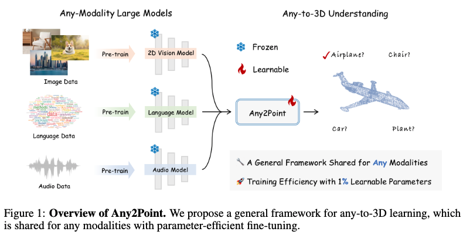

# Any2Point: Empowering Any-modality Large Models for Efficient 3D Understanding
Official implementation of ['Any2Point: Empowering Any-modality Large Models for Efficient 3D Understanding']().

<p align="center">                                                                                                                                           <br>
</p>

## Introduction
Large foundation models have recently emerged as a prominent focus of interest, attaining superior performance in widespread scenarios. Due to the scarcity of 3D data, many efforts have been made to adapt pre-trained transformers from vision to 3D domains. However, such 2D-to-3D approaches are still limited, due to the potential loss of spatial geometries and high computation cost. More importantly, their frameworks are mainly designed for 2D models, lacking a general any-to-3D paradigm. In this paper, we introduce **Any2Point**, a parameter-efficient method to empower any-modality large models (vision, language, audio) for 3D understanding. Given a frozen transformer from any source modality, we propose a 3D-to-any (1D or 2D) virtual projection strategy that correlates the input 3D points to the original 1D or 2D positions within the source modality. This mechanism enables us to assign each 3D token with a positional encoding paired with the pre-trained model, which avoids 3D geometry loss caused by the true projection and better motivates the transformer for 3D learning with 1D/2D positional priors. Then, within each transformer block, we insert an any-to-3D guided adapter module for parameter-efficient fine-tuning. The adapter incorporates prior spatial knowledge from the source modality to guide the local feature aggregation of 3D tokens, compelling the semantic adaption of any-modality transformers. We conduct extensive experiments to showcase the effectiveness and efficiency of our method.

<div align="center">
  
</div>

## Main Results
We report the pre-training modality (Pre-train), the number of learnable parameters (\#Param) on the "PB-T50-RS" split of ScanObjectNN (SCAN.) and ModelNet40 (MN.). * indicates utilizing the voting strategy.
| Method                  | Pre-train  | #Param(M) | SCAN.(%) | MN.(%)   |
|-------------------------|------------|-----------|----------|----------|
| PointNet                | N/A        | 3.5       | 68.0     | 89.2     |
| PointNet++              | N/A        | 1.5       | 77.9     | 90.7     |
| DGCNN                   | N/A        | 1.8       | 78.1     | 92.9     |
| PointMLP                | N/A        | 12.6      | 85.4     | 94.1     |
| Point-PN                | N/A        | 0.8       | 87.1     | 93.8     |
| PointNeXt               | N/A        | 1.4       | 87.7     | 94.0     |
| Point-BERT              | 3D         | 22.1      | 83.1     | 92.7     |
| Point-MAE               | 3D         | 22.1      | 85.2     | 93.2     |
| Point-M2AE              | 3D         | 15.3      | 86.4     | 93.4     |
| P2P-HorNet              | 2D         | 1.2       | 89.3     | 94.0*    |
| ACT                     | 3D+2D      | 22.1      | 88.2     | 93.7     |
| I2P-MAE                 | 3D+2D      | 12.9      | 90.1     | 93.7     |
| ReCon                   | 3D+2D+Language | 43.6  | 90.6     | 94.1     |
| Any2Point (Audio)       | Audio      | **0.8**   | **87.0** | **92.7** |
| Any2Point (2D)          | 2D         | **0.8**   | **87.7** | **93.2** |
| Any2Point (Language)    | Language   | **0.9**   | **91.9** | **94.3** |


## Ckpt Release

Real-world shape classification on the PB-T50-RS split of ScanObjectNN:
| Method | Logs | Acc.| Ckpts |
| :-----: | :-----:|:-----:| :-----:|
| Any2Point-Lang-CLIP | [Language_CLIP_Scan.log](https://drive.google.com/file/d/1NGBY87PiTf8mkAThRjJCiUsSidRv28Kb/view?usp=sharing) | 91.9% | [Language_CLIP_Scan.pth](https://drive.google.com/file/d/1votPHTcD3KQ6fmdcZvUCZc5yMq4xbK0V/view?usp=sharing) |
| Any2Point-Vision-DINOV2 | [Vision_DINOV2_Scan.log](https://drive.google.com/file/d/1apIv0AOlL4utn7lXofhX_Tv2xy0EvAS_/view?usp=sharing) | 87.7% | [Vision_DINOV2_Scan.pth](https://drive.google.com/file/d/1cTCKNc5xfbMvLnQOj9BQf-uHg3Fime-W/view?usp=sharing) |
| Any2Point-Audio-ImageBind | [Audio_imagebind_scan.log](https://drive.google.com/file/d/176DtBKcWyn1Y22w2X0vQ0qz0sYqBYofv/view?usp=sharing) | 87.0% | [Audio_imagebind_scan.pth](https://drive.google.com/file/d/1mKFeKVfSyiBba2DNEY6gPPqDrINQBS2F/view?usp=sharing) |

Synthetic shape classification on the ModelNet40:
| Method | Logs | Acc.| Ckpts |
| :-----: | :-----:|:-----:| :-----:|
| Any2Point-Lang-CLIP | [Language_CLIP_ModelNet.log](https://drive.google.com/file/d/1-yR0E9iN2XmMbqFylxdEeIRfYZu2DlAp/view?usp=sharing) | 94.3% | [Language_CLIP_ModelNet.pth](https://drive.google.com/file/d/1DCIA6gfCjwOmauo7m4gh03DxOQB5KG4d/view?usp=sharing) |
| Any2Point-Vision-DINOV2 | [Vision_DINOV2_ModelNet.log](https://drive.google.com/file/d/122LQF8PkF8HiqkzP9OTdT34OrJmK4aKs/view?usp=sharing) | 93.2% | [Vision_DINOV2_ModelNet.pth](https://drive.google.com/file/d/1bApmj6GgCPcJrlm7Ke3pFs34LApGUnjX/view?usp=sharing) |
| Any2Point-Audio-ImageBind | [Audio_imagebind_ModelNet.log](https://drive.google.com/file/d/1UBppIkS65TdgpCB-w6jju-atZ5Tqup3v/view?usp=sharing) | 92.7% | [Audio_imagebind_ModelNet.pth](https://drive.google.com/file/d/163-Pskgx8GXdlN26itbds8fqmfzTYMl2/view?usp=sharing) |


## Get Started

### Installation
Create a conda environment and install basic dependencies:
```bash
git clone https://github.com/EvenJoker/Point-PEFT.git
cd Point-PEFT

conda create -n point-peft python=3.8
conda activate point-peft

# Install the according versions of torch and torchvision
conda install pytorch torchvision cudatoolkit
# e.g., conda install pytorch==1.11.0 torchvision==0.12.0 torchaudio==0.11.0 cudatoolkit=11.3

pip install -r requirements.txt
```
Install GPU-related packages:
```bash
# Chamfer Distance and EMD
cd ./extensions/chamfer_dist
python setup.py install --user
cd ../emd
python setup.py install --user

# PointNet++
pip install "git+https://github.com/erikwijmans/Pointnet2_PyTorch.git#egg=pointnet2_ops&subdirectory=pointnet2_ops_lib"

# GPU kNN
pip install --upgrade https://github.com/unlimblue/KNN_CUDA/releases/download/0.2/KNN_CUDA-0.2-py3-none-any.whl
```
### Dataset
For pre-training and fine-tuning, please follow [DATASET.md](https://github.com/lulutang0608/Point-BERT/blob/master/DATASET.md) to install ModelNet40, ScanObjectNN, and ShapeNetPart datasets, referring to Point-BERT. Specially Put the unzip folder under `data/`.

The final directory structure should be:
```
│Point-PEFT/
├──cfgs/
├──datasets/
├──data/
│   ├──ModelNet/
│   ├──ScanObjectNN/
├──...
```

### Fine-tuning
Please download the [ckpt-best.pth](https://drive.google.com/file/d/16oJrxbLlDLMp1nA8W3EEjRA-cENReAU9/view?usp=sharing), [pre-train.pth](https://drive.google.com/file/d/1m9biTvZN098NP3IwJuTt3kWI0t-sIKSn/view?usp=sharing) and [cache_shape.pt](https://drive.google.com/file/d/1YdUlBL2QpimMBvyK3XaDcUCVxMQP1-1h/view?usp=sharing) into the `ckpts/` folder. 

For the PB-T50-RS split of ScanObjectNN, run:
```bash
sh Finetune_cache_prompt_scan.sh
```

## Acknowledgement
This repo benefits from [Point-M2AE](https://github.com/ZrrSkywalker/Point-M2AE), [Point-BERT](https://github.com/lulutang0608/Point-BERT), [Point-MAE](https://github.com/Pang-Yatian/Point-MAE). Thanks for their wonderful works.
